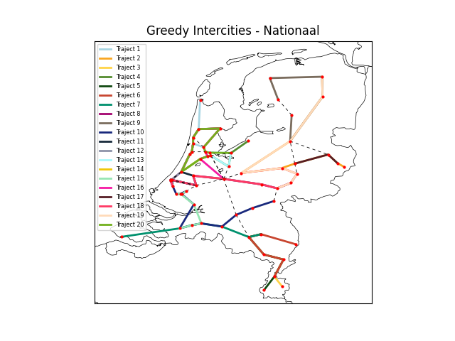

# RailNL

Deze case gaat over het bepalen van de lijnvoering van intercitytreinen in Nederland. Met lijnvoering wordt de trajecten waarover de treinen gedurende de dag heen en weer rijden bedoelt. Een traject bestaat uit minstens twee stations die verbonden zijn door minstens één connectie. Er zijn een aantal restricties bij deze case: in Holland mogen er maximaal 7 trajecten worden gemaakt en mag de tijd in één traject maximaal 120 minuten zijn. Voor Nationaal is het maximum 20 trajecten en maximaal 180 minuten per traject.

RailNL heeft een doelfunctie opgesteld om de kwaliteit van de lijnvoering te bepalen. Het doel is dat de kwaliteit van de lijnvoering zo hoog mogelijk is en dat deze doelfunctie dus wordt gemaximaliseerd.

Doelfunctie: K = p × 10000 − (T × 100 + Min)

Hierin is p de fractie van de gebruikte connecties (aantal gebruikte connecties / totaal aantal connecties) , T het aantal trajecten en Min het aantal minuten in alle trajecten samen.

# Aan de slag

## Vereisten
```
pip install -r requirements.txt
```

Voor het plotten van de kaarten is een extra package nodig. De code werkt ook zonder onderstaande package.
```
pip install basemap basemap-data basemap-data-hires
```

## Gebruik
```
python main.py map [-N] [-V] [-a] [-s]
```
```map``` str; voor welke data trajecten gegenereerd moeten worden; keuze: [Nationaal, Holland]  
Optioneel:  
```-N``` int, het aantal runs (default: 1)  
```-V``` int; of er een kaart geplot moet worden met de gegenereerde trajecten; keuze: [0, 1] (default: 0)  
```-a``` str; welke algoritmes gerund moeten worden; (default: 5,1)  
```-s``` int; de random seed waarmee algoritmes moeten werken; (default=None)  

**N.B.:** De input van ```-a``` is een door komma's gesplitste combinatie van de cijfers 1 tot en met 5 en de letter 'h'. De cijfers corresponderen met de mogelijke algoritmes die uitgevoerd kunnen worden op de data. Door een 'h' toe te voegen aan het cijfer, zal het programma ook de HillClimber toepassen op dit algoritme.

Hieronder is te zien welk cijfer bij welk algoritme hoort:  
1. AdaptedGreedy  
2. Greedy
3. NewRandom
4. RandomGreedy
5. Random

Wanneer de algoritmes Greedy, RandomGreedy en Random gerund moeten worden en bij de Greedy is ook de HillClimber gewenst is, is de input dus ```-a 2h,4,5```.

**Let op:** Het genereren van oplossingen met de HillClimber kan bij grote aantallen runs erg lang duren.

# Algoritmen

## Random
Random is een algoritme wat redelijk random een oplossing genereerd door eerst random een startstation te kiezen en daarna random een vervolgstation te kiezen. Dit algoritme is niet helemaal random, omdat het alleen geldige oplossingen genereerd en omdat er in hetzelfde traject een station en connectie niet meer dan één keer mogen voorkomen.

## AdaptedGreedy
AdaptedGreedy start bij de stations met de minste connecties, waarna alle stations in het traject geen optie meer zijn voor de volgende startstations van een traject. Als er geen stations meer over zijn om mee te starten wordt er gekeken naar de nog niet gepasseerde connecties en wordt random een van die twee stations als startstation van het traject gekozen. Wanneer er connecties gemaakt worden binnen een traject wordt er gekeken naar het aantal mogelijkeheden in vervolgconnecties en hoe vaak een connectie al is gepasseerd en wordt de connectie met de minste mogelijkheden en minst gepasseerde connectie als volgende verbinding van het traject gekozen. Een traject is af wanneer de tijd bijna gelijk is aan de gegeven maximale tijd. Dit gaat door tot het maximale aantal trajecten is bereikt of wanneer alle connecties gepasseerd zijn.

## HillClimber
Het HillClimber algoritme wordt gebruikt om een eerder gegenereerde (geldige) oplossing te verbeteren. Dit betekent dat de HillClimber altijd afhankelijk is van een ander algoritme dat een startconfiguratie genereert. De HillClimber maakt enkel kleine veranderingen en vergelijkt de nieuwe score met de huidige (beste) score. Als deze nieuwe score hoger is dan de huidige score, wordt de verandering behouden. Anders wordt de verandering teruggedraaid en kan de verandering niet opnieuw geprobeerd worden.

Het algoritme werkt in vier stappen waarbij na elke geldige verandering berekend wordt of de score is verbeterd:

**Stap 1:** Er wordt een willekeurig traject gekozen en daar wordt het laatste station van verwijderd. Als de score hierdoor is verbeterd, wordt een nieuw traject gekozen. Hierbij blijft het aangepaste traject een optie. Als het geen verbetering oplevert, wordt het traject verwijderd uit de mogelijke opties en wordt er een ander traject gekozen. Dit blijft zich herhalen totdat er geen trajecten meer aangepast kunnen worden.

**Stap 2:** Er wordt een willekeurig traject gekozen met een lengte van twee stations. Vervolgens wordt er gekeken of het verwijderen van het volledige traject een betere score oplevert. Als alle trajecten met twee stations geprobeerd zijn, worden trajecten met een steeds langer wordende lengte geprobeerd.

**Stap 3:** Er wordt een willekeurig traject gekozen en gekeken of deze achter een bestaand traject toegevoegd kan worden, door te controleren of het start- en eindstation van de trajecten gelijk zijn. Hierdoor kunnen er dus connecties tussen de trajecten gemaakt worden.

**Stap 4:** Als er nog ongebruikte connecties zijn wordt er gekeken of deze toch gemaakt kunnen worden door deze aan het eind van een bestaand traject toe te voegen.

## Extra algoritmes
Naast de hierboven genoemde algoritmes zijn er nog andere extra algoritmes. De HillClimber kan ook worden toegepast op deze algoritmes.

NewRandom werkt over het algemeen hetzelfde als Random en is dus ook niet helemaal random. Bij NewRandom is er toegevoegd dat het startstation wordt gekozen op basis van minst aantal connecties.

Alle Greedy algoritmes kiezen het startstation op dezelfde manier. Het verschil zit in het kiezen van de connecties voor de rest van het traject.
De Greedy kiest de connectie met het minst aantal mogelijke vervolgconnecties. RandomGreedy kiest random een connectie.

# Resultaten
Het resultaat is een output.csv met daarin de trajecten en de score van de doelfunctie. Dit resultaat wordt weergegeven in een kaart, hierop zijn de verschillende trajecten getekend met verschillende kleuren. De ongebruikte connecties zijn zwarte stippellijnen.

<p align="center">
Voorbeeld kaart:<br>

</p>


# Structuur
De hierop volgende lijst beschrijft de belangrijkste mappen en files in het project, en waar deze te vinden zijn:

- **/code**: bevat alle code van dit project
  - **/code/algorithms**: bevat de code voor algoritmes
  - **/code/classes**: bevat de drie benodigde classes voor deze case
  - **/code/visualisation**: bevat de code voor de visualisatie van de kaart, histogram en barplot
  - **run.py**: runt de algoritmes
- **/data**: bevat de verschillende databestanden die nodig zijn om de graaf te vullen
- **/plots**: bevat de kaarten van de gerunde algoritmes
<br>

# Auteurs
- Niels Schröder
- Esmeé van der Klis
- Nienke van den Hurk