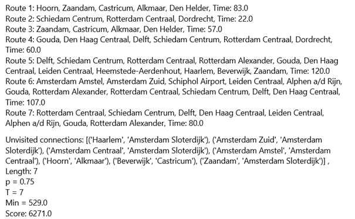

# Baseline

## Niet helemaal random...
Het algoritme is niet helemaal random, omdat:
- In dezelfde route kan dezelfde connectie niet meer dan één keer gemaakt worden.
  Voorbeeld: Een route van Alkmaar - Hoorn - Alkmaar is hierdoor niet mogelijk.
- In dezelfde route kan hetzelfde station niet nog een keer voorkomen.
  Voorbeeld: Een route van Amsterdam Centraal - Amsterdam Amstel - Amsterdam Zuid - Amsterdam Sloterdijk - Amsterdam Centraal is hierdoor niet mogelijk.
- De routes mogen niet langer zijn dat een bepaalde tijd, hierdoor kunnen routes niet oneindig lang worden.
- Het aantal routes is ook begrensd
- Het algoritme neemt alleen geldige oplossingen mee (alleen connecties die bestaan). Hierdoor worden ongeldige oplossingen uitgesloten.

## Voorbeeld resultaat

### Gemiddelde resultaat
De gemiddelde score is ongeveer 6900.

### Uitleg
De score wordt berekend op basis van de volgende formule: K = p * 10000 - (T * 100 + Min). In deze formule is K de kwaliteit van de gegenereerde routes, p de fractie van de gebruikte connecties, T het aantal trajecten en Min de totale tijd van alle trajecten (in minuten).

Dit zijn de resultaten van een lijnvoering voor Holland. Er zijn enkele connecties niet gebruikt, dit is omdat er random routes worden gegenereerd, hierdoor is p dus niet gelijk aan 1. Dit is dus geen goede oplossing, omdat niet alle verbindingen worden gemaakt. Als je het random algoritme vaak genoeg itereert kunnen er wel oplossingen onstaan waarbij alle connecties gebruikt zijn. Het kan natuurlijk altijd dat je met een random algoritme heel dicht bij een optimale uitkomst kunt komen.

## Vooruitblik
We gaan de stations sorteren op basis van het aantal connecties. De stations met de minste aantal connecties zullen als eerste gekozen worden als startstation. Vervolgens gaan wij het greedy algoritme toepassen door elke keer het station met het minst aantal connecties toe te voegen aan het traject.