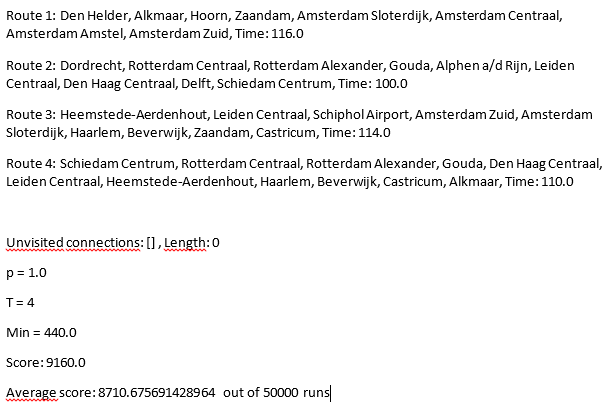

# Algroritme 1

## Adapted Greedy
We hebben een variatie op Greedy gekozen, omdat we op deze manier de stations met de minst aantal verbindingen als eerste kunnen toevoegen aan een route. We hebben verschillende soorten variaties van het Greedy algoritme geprobeerd. Uiteindelijk hebben we een algoritme gevonden die start bij de stations met de minste connecties, waarna alle stations in de route geen optie meer zijn voor de volgende startstations van een routes. Als er geen stations meer over zijn om mee te starten wordt er gekeken naar de nog niet gepasseerde connecties en wordt random een van die twee stations als startstation van de route gekozen. Wanneer er connecties gemaakt worden tussen de stations wordt er gekeken naar hoe vaak een connectie al is gepasseerd en wordt de minst gepasseerde connectie als volgende verbinding van het traject gekozen. Dit gaat door tot het maximale aantal trajecten is bereikt of wanneer alle connecties gepasseerd zijn.

## Voorbeeld resultaat

### Analyse
Zoals te zien is in het voorbeeld resultaat geeft de greedy met 50.000 runs als hoogste score de waarde 9160 voor de kaart van Holland. Dit is een grote verbetering ten opzichte van het random algoritme, wat met 50.000 runs een beste score van 6900 gaf. Verder is een verschil dat in greedy alle connecties gebruikt worden en in random gebeurt dit niet altijd.

## Proces
Voordat we tot de adapted greedy zijn gekomen zijn daar veel stappen en andere varianten van dit algoritme aan vooraf gegaan. De overeenkomst tussen deze algoritmes is dat zij allemaal het startstation op dezelfde manier bepalen (uitgelegd bij adapted greedy). Het verschil in deze algoritmes is dat zij allemaal op een net even andere manier een vervolgconnectie kiezen. Zo wordt bij greedy de connectie gekozen met het minst aantal vervolgconnecties, omdat deze connectie moeilijk is om aan een route toe te voegen. Bij reverse greedy is dit precies omgedraaid: de connectie met het meest aantal vervolgconnecties wordt gekozen, omdat dit zorgt voor veel mogelijkheden voor de vervolgroute. Bij het random greedy algoritme wordt er random een connectie gekozen. Uiteindelijk heeft adapted greedy tot de beste resultaten geleid en hebben we voor dit algoritme gekozen.